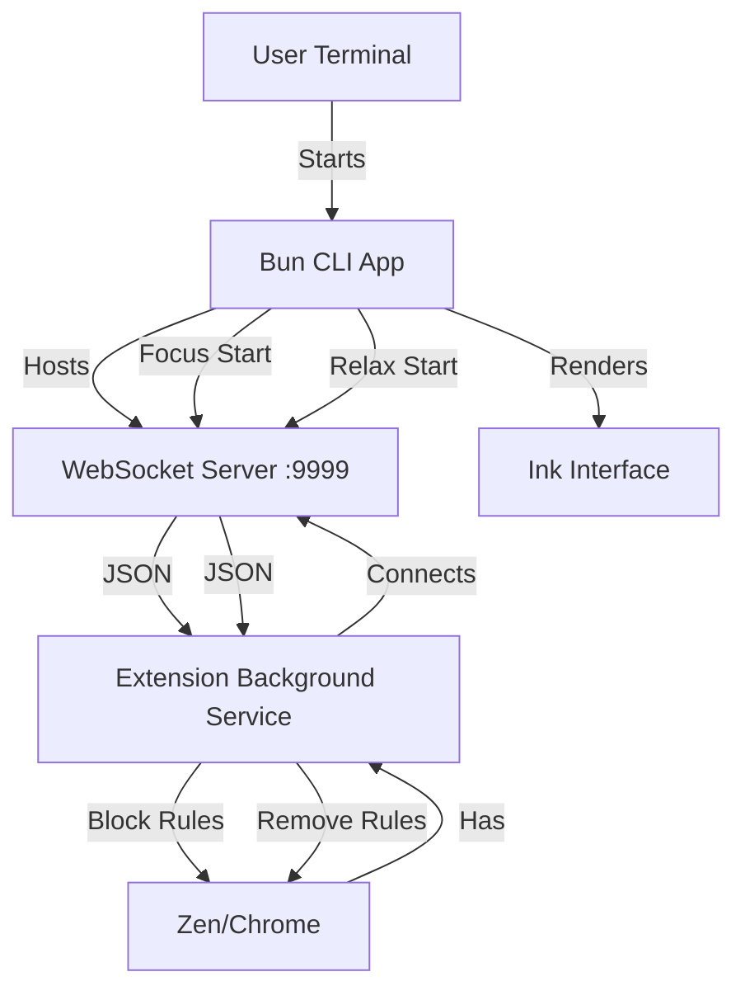

# 🍅 Pomolocal

**Tagline:** A Mac-first, "Anti-Distraction" CLI Pomodoro timer that physically blocks sites in your browser.

---

## 1. Executive Summary
Pomolocal is a developer-centric productivity tool designed for the terminal. It combines a beautiful, immersive TUI (Terminal User Interface) with a "Watchdog" browser extension. When the user enters Focus Mode in the terminal, the browser extension receives a signal to actively block distracting websites (social media, news, etc.) using native browser APIs.

### Core Philosophy
*   **Mac-First:** Leverages native macOS tools (`osascript`) for a seamless experience.
*   **Local & Private:** No accounts, no cloud, no external tracking. Everything happens on localhost.
*   **Aesthetically Pleasing:** A TUI that looks so good you'll want to keep your terminal window open.

---

## 2. Technical Stack

| Component | Technology | Reasoning |
| :--- | :--- | :--- |
| **Runtime** | Bun | Instant startup time, native TypeScript support, built-in WebSocket server. |
| **TUI Framework** | React Ink | Component-based UI for the CLI. Allows for complex layouts and state management. |
| **Styling** | Ink Gradient / Big Text | Provides the high-fidelity "Digital Clock" aesthetic. |
| **Communication** | WebSockets | Real-time, bi-directional link between CLI and Browser (low latency). |
| **Extension** | Manifest V3 | Standard WebExtension format (supports Zen, Chrome, Arc, Brave, Edge). |
| **Blocking** | `declarativeNetRequest` | The modern, performant, and privacy-preserving way to block network requests. |

---

## 3. User Experience (UX)

### 3.1 The Command Line Interface
The user launches the application with customizable time settings via the terminal.

```bash
$ bunx pomolocal --session 25m --relax 5m --loop 4
```

**Arguments:**
*   `--session <time>`: Duration of focus sessions (e.g., 25m, 45m). *Default: 25m.*
*   `--relax <time>`: Duration of short breaks (e.g., 5m, 10m). *Default: 5m.*
*   `--loop <count>`: Number of Focus/Relax cycles before a long break or exit. *Default: 4.*
*   `--sound <name>`: (Optional) The macOS system sound to play (e.g., "Glass", "Submarine"). *Default: "Glass".*

### 3.2 The Visual TUI States
The terminal screen is cleared and replaced by an immersive dashboard.

*   **A. Focus Mode**
    *   *Visual:* Giant ASCII Clock (24:59) with a Red-Orange Gradient.
    *   *Status:* "🍅 FOCUS MODE ENABLED" (Blinking or Bold).
    *   *Browser:* Extension is **ACTIVE**. Social media sites return a "Blocked" status.
*   **B. Relax Mode**
    *   *Visual:* Giant ASCII Clock (05:00) with a Green-Blue Gradient.
    *   *Status:* "☕ RELAX TIME" (Calm colors).
    *   *Browser:* Extension is **DISABLED**. Internet usage is free.
*   **C. Finished**
    *   *Visual:* Summary of session stats (Total time focused).
    *   *Action:* App exits gracefully, ensuring all blocks are lifted.

### 3.3 Controls & Inputs
*   `Space`: Pause/Resume Timer.
*   `s`: Skip current phase (jump from Focus to Relax instantly).
*   `q`: Quit application (Triggers cleanup sequence to unblock sites).

### 3.4 Notifications & Sound
*   **Visual & Audio:** Uses the native macOS Notification Center.
*   **Mechanism:** A single system notification triggers both the banner and the sound (e.g., "Ping", "Glass", "Submarine") synchronously. No external audio files are required.

---

## 4. System Architecture

### 4.1 The High-Level Flow


### 4.2 The Communication Protocol
Messages are sent as JSON over `ws://localhost:9999`.

**Server -> Client (Extension)**
```json
{
  "type": "STATE_UPDATE",
  "mode": "FOCUS",
  "blockedDomains": ["x.com", "facebook.com", "youtube.com"]
}
```

**Client (Extension) -> Server**
*   `"ping"`: Heartbeat message sent every 20s to keep the connection alive.

---

## 5. Detailed Implementation Specs

### 5.1 The Bun CLI (`src/index.tsx`)
*   **Entry Point:** Uses `meow` to parse args.
*   **State Machine:** Uses `React.useState` and `useEffect` to manage the timer countdown. On state transition, calls `notify()` and `broadcastToExtension()`.
*   **WebSocket Server:** Initialized inside the main process using `Bun.serve`. Maintains a `Set` of connected clients and handles ping/pong to prevent Chrome Service Worker sleep.

### 5.2 The Notification System
We utilize the standard AppleScript `display notification` command.
```bash
osascript -e 'display notification "Focus Mode Started" with title "Pomolocal" sound name "Glass"'
```
*   **Advantage:** Zero dependencies, perfectly integrated with macOS "Do Not Disturb" settings.

### 5.3 The Browser Extension (`manifest.json`)
*   **Permissions:** `declarativeNetRequest` (blocking), `storage` (preferences), `alarms` (keep-alive).
*   **Background Script (`background.js`):**
    *   Connects to WebSocket on load.
    *   Sets up a `chrome.alarms` listener (1-minute interval) to check connection health.
    *   **On "FOCUS":** Calls `chrome.declarativeNetRequest.updateDynamicRules` to add block rules.
    *   **On "RELAX":** Clears all dynamic rules.
    *   **Fail-safe:** On WebSocket `onclose`, immediately clear all rules to prevent accidental "permablocking."

---

## 6. Project Structure
```text
/pomolocal
├── package.json
├── README.md
├── extension/             # The Unpacked Extension
│   ├── manifest.json
│   ├── background.js
│   └── icons/
└── src/
    ├── index.tsx          # CLI Entry
    ├── server.ts          # WebSocket Logic
    ├── ui.tsx             # React Ink Components
    ├── timer.ts           # Countdown Logic
    └── sound.ts           # osascript wrapper
```

---

## 7. Future Considerations (V2)
*   **Config File:** Support a `~/.pomolocalrc` file for custom blocklists.
*   **Stats Tracking:** Save session history to a local JSON file to generate weekly reports.
*   **Strict Mode:** Prevent quitting the CLI until the timer finishes (requires aggressive process handling).